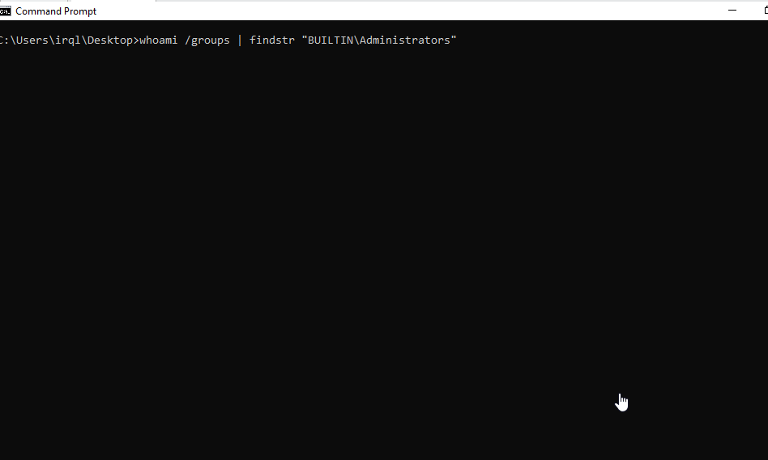

### CVE-2021-31727 and CVE-2021-31728
###### [Public Reference for CVE-2021-31727](CVE-2021-31727.md)
Exposes unrestricted disk read/write capabilities.
###### [Public Reference for CVE-2021-31728](CVE-2021-31728.md)
Exposes arbitrary ring 0 code execution directly.

### Credit
[Lima X](https://github.com/Lima-X) helped with SystemBigPoolInformation idea.
